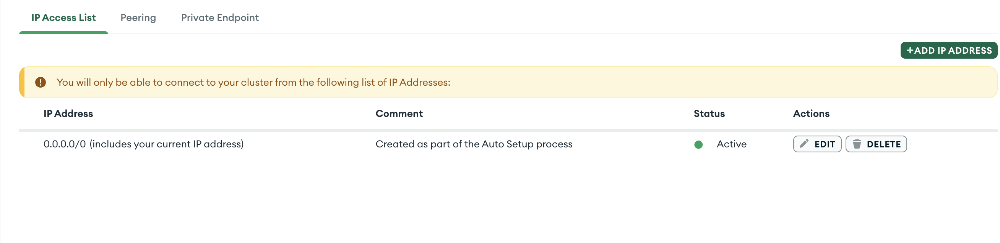

# Fullstack-Projekt veröffentlichen

- **_Frontend_** auf Vercel und
- **_Backend_** auf Render

Die Bereitstellung einer Typescript-, Vite-, Express- und MongoDB-Anwendung erfordert eine sorgfältige Vorbereitung und Konfiguration.

## Projektstruktur

```python
  project-loggin/
├── client/   # React + Vite + TypeScript + Tailwind CSS
└── backend/  # Express + TypeScript + MongoDB + Mongoose
```

## Frontend (React + Vite + TypeScript)

### Umgebungsvariablen

> Stelle sicher, dass du die Umgebungsvariablen korrekt setzt.

#### Lokale Entwicklung

- **_`client/.env.local`_** für lolake Entwicklung

  ```tsx
   VITE_API_URL=http://localhost:5000

  ```

- **_`client/.env.production`_**

  ```tsx
   VITE_API_URL=https://dein-backend.onrender.com/


  ```

### Projekt builden

- Führe den folgenden Befehl im client-Verzeichnis aus:

  ```bash
    npm run build  # Dies erstellt einen `dist`-Ordner
  ```

### Auf Vercel deployen

1. **_Gehe_** zu vercel.com

2. **_Neues Projekt erstellen_** > Repository auswählen

3. **_Als Root Directory:_** client

4. **_Build Command:_** npm run build

5. **_Output Directory:_** dist

6. **_Environment Variables_** unter „Settings“ hinzufügen:

   - `VITE_API_URL=https://<DEIN-BACKEND>.onrender.com/api`

## Backend (Express + Typescript + mongoose) deployen

### Umgebungsvariablen

Erstelle im Backend-Ordner eine .env-Datei mit folgendem Inhalt:

- Bereite deine Zugansdaten von:

  - **_MongoDb/MySQL_** : `mongodb+srv://<your_accounT-name>:<db_password>@cluster0.ibsxpes.mongodb.net/`
  - **_Clounary_**
  - **_Resend_**
  - u.a

- Prüfe deine **.env**-Datei

  ```env
  PORT=5000
  MONGODB_URI=mongodb+srv://<username>:<password>@cluster.mongodb.net/dbname
  PORT=5000
  JWT_SECRET=fr+mlwWf8V2OQ9Z1EKUOXU9WOKNb3anFNch6YVopcr+k6jn/xcWVVKtf4EPd7Gkg+1roFeK6rq3unsBJ+HRlw==
  FRONTEND_URL=http:localhost:5173

  ```

### MongoDB Netzwerkeinstellungen

- **_Erlaube IP-Zugriff von überall:_**

  - Gehe zu MongoDB Atlas > Network Access

  - Erlaube IP-Adresse 0.0.0.0/0



### `package.json` anpassen

```json
   "scripts": {
    "build": "tsc ",
    "start": "node ./dist/index.js",
    "dev": "ts-node-dev --respawn src/index.ts"
},
```

- `--respawn`:
  Dieser Zusatz sorgt dafür, dass der Prozess automatisch neu gestartet wird, wenn es intern notwendig ist (z. B. bei bestimmten Änderungen oder Fehlern).

### Typescript kompilieren

- Führen im Backend-Ordner aus:

  1. Kompiliere deinen Typscript-Code mit:

  ```bash
  tsc
  ```

  2. Erstelle dein `dist`-Ordner mit:

  ```bash
      npm run build
  ```

  3. Start dein Projekt:

  ```bsh
    node run start
  ```

### Auf Render deployen


- **_Root Directory:_** backend (Je nach Projekt für unser ist Backend)

## Referenz

- [How to Deploy/Host TypeScript Node/Express JS server for FREE | Deploy Typescript Backend for FREE](https://www.youtube.com/watch?v=gBsLVilQmKk)
-
